# 1) Data visualization: Flights at ABIA

    library(tidyverse)

    ## ── Attaching packages ─────────────────────────────────────── tidyverse 1.3.1 ──

    ## ✓ ggplot2 3.3.5     ✓ purrr   0.3.4
    ## ✓ tibble  3.1.3     ✓ dplyr   1.0.7
    ## ✓ tidyr   1.1.3     ✓ stringr 1.4.0
    ## ✓ readr   2.0.0     ✓ forcats 0.5.1

    ## ── Conflicts ────────────────────────────────────────── tidyverse_conflicts() ──
    ## x dplyr::filter() masks stats::filter()
    ## x dplyr::lag()    masks stats::lag()

    library(ggplot2)
    ABIA <- read.csv("~/Dropbox/My Mac (Colin’s MacBook Pro)/Downloads/data-mining/ABIA.csv")

    #Changing NA Delay Results to O#
    new_ABIA=ABIA%>%
      mutate_all(~replace(., is.na(.), 0))
    View(new_ABIA)

    #Beginning to Work the Data#
    month_delays=new_ABIA%>%
      mutate(total_delay=CarrierDelay+WeatherDelay+NASDelay+SecurityDelay+LateAircraftDelay,depart_hour=CRSDepTime%/%100,month_names=month.name[Month])%>%
      filter(Origin=='AUS')%>%
      group_by(month_names,depart_hour)%>%
      select(month_names,depart_hour,total_delay)%>%
      summarize(count=n(),sum_delays=sum(total_delay), avg_delay=sum_delays/count)

    ## `summarise()` has grouped output by 'month_names'. You can override using the `.groups` argument.

    View(month_delays)

    #Creating the Graph#
    ggplot(month_delays)+
      geom_col(aes(x=depart_hour,y=avg_delay))+
      facet_wrap(~factor(month_names,levels=c('January','February','March','April','May','June','July','August','September','October','November','December')))+
      xlab('Expected Departure Hour')+
      ylab('Average Delay for a Flight (min)')+
      labs(
        title='Average Length of Delay Each Month for Each Hour of Flights Leaving Austin'
      )

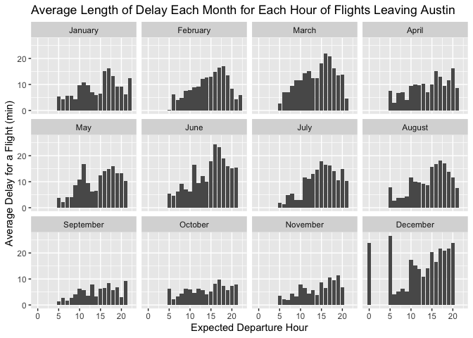
For me there is nothing worse than a flight delay. When on a flight the
level of annoyance I have for a delay greatly outweighs any semblance of
utility I gain from an early or on-time flight. So I wanted to know what
were the worst times of day to expect delays in any given month when
leaving ABIA. And that is what these graphs are showing you. Peak delays
out of ABIA occur when you would expect them like around Christmas and
during Summer Vacation. So do not book flights out of Austin in the late
afternoon in July! \# 2) Wrangling the Billboard Top 100

    library(tidyverse)
    library(ggplot2)
    library(rmarkdown)
    setwd('~/Dropbox/My Mac (Colin’s MacBook Pro)/Downloads/data-mining')
    billboard <- read.csv("billboard.csv")

    #Part A of Question 2 Data Mining#
    best_10=billboard%>%
      group_by(performer,song)%>%
      summarize(count=n())%>%
      select(performer,song,count)%>%
      arrange(desc(count))%>%
      head(10)

    ## `summarise()` has grouped output by 'performer'. You can override using the `.groups` argument.

    best_10

    ## # A tibble: 10 × 3
    ## # Groups:   performer [10]
    ##    performer                              song                             count
    ##    <chr>                                  <chr>                            <int>
    ##  1 Imagine Dragons                        Radioactive                         87
    ##  2 AWOLNATION                             Sail                                79
    ##  3 Jason Mraz                             I'm Yours                           76
    ##  4 The Weeknd                             Blinding Lights                     76
    ##  5 LeAnn Rimes                            How Do I Live                       69
    ##  6 LMFAO Featuring Lauren Bennett & Goon… Party Rock Anthem                   68
    ##  7 OneRepublic                            Counting Stars                      68
    ##  8 Adele                                  Rolling In The Deep                 65
    ##  9 Jewel                                  Foolish Games/You Were Meant Fo…    65
    ## 10 Carrie Underwood                       Before He Cheats                    64

    #Part B of Question 2 Data Mining#
    musical_diversity=billboard%>% 
      filter(year>1958 & year<2021)%>%
      group_by(year,song_id)%>%
      summarize(count=n())%>%
      arrange(desc(count))

    ## `summarise()` has grouped output by 'year'. You can override using the `.groups` argument.

    musical_diversity

    ## # A tibble: 35,078 × 3
    ## # Groups:   year [62]
    ##     year song_id                                            count
    ##    <int> <chr>                                              <int>
    ##  1  1997 Foolish Games/You Were Meant For MeJewel              52
    ##  2  2013 RadioactiveImagine Dragons                            52
    ##  3  2020 Blinding LightsThe Weeknd                             52
    ##  4  2012 LightsEllie Goulding                                  51
    ##  5  2020 I HopeGabby Barrett Featuring Charlie Puth            51
    ##  6  1997 Barely BreathingDuncan Sheik                          50
    ##  7  2012 Somebody That I Used To KnowGotye Featuring Kimbra    50
    ##  8  2015 Uptown Funk!Mark Ronson Featuring Bruno Mars          50
    ##  9  2011 Rolling In The DeepAdele                              49
    ## 10  2014 All Of MeJohn Legend                                  49
    ## # … with 35,068 more rows

    actual_diversity=musical_diversity%>%
      group_by(year)%>%
      summarize(count=n())%>%
      arrange(desc(count))

    actual_diversity  

    ## # A tibble: 62 × 2
    ##     year count
    ##    <int> <int>
    ##  1  1966   832
    ##  2  1967   827
    ##  3  1964   811
    ##  4  2020   804
    ##  5  1965   800
    ##  6  1961   779
    ##  7  1968   772
    ##  8  1962   768
    ##  9  1969   762
    ## 10  1963   754
    ## # … with 52 more rows

    #Creating a Graph for Diversity Statistics#
    ggplot(actual_diversity)+
      geom_line(aes(x=year,y=count))+
      ylim(1,1000)+
      xlab('Year')+
      ylab('Unique Songs')+
      labs(
        title='Song Diversity by Year'
      )

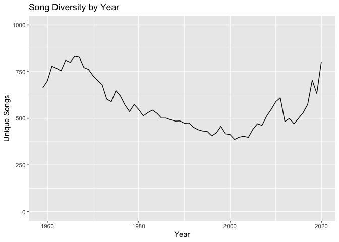

    #Part C of Question 2 Data Mining#
    preliminary_hit=billboard%>% 
      group_by(song, performer)%>%
      summarize(count=n())%>%
      filter(count>=10)%>%
      arrange(desc(count))

    ## `summarise()` has grouped output by 'song'. You can override using the `.groups` argument.

    preliminary_hit

    ## # A tibble: 14,807 × 3
    ## # Groups:   song [13,112]
    ##    song                              performer                             count
    ##    <chr>                             <chr>                                 <int>
    ##  1 Radioactive                       Imagine Dragons                          87
    ##  2 Sail                              AWOLNATION                               79
    ##  3 Blinding Lights                   The Weeknd                               76
    ##  4 I'm Yours                         Jason Mraz                               76
    ##  5 How Do I Live                     LeAnn Rimes                              69
    ##  6 Counting Stars                    OneRepublic                              68
    ##  7 Party Rock Anthem                 LMFAO Featuring Lauren Bennett & Goo…    68
    ##  8 Foolish Games/You Were Meant For… Jewel                                    65
    ##  9 Rolling In The Deep               Adele                                    65
    ## 10 Before He Cheats                  Carrie Underwood                         64
    ## # … with 14,797 more rows

    ten_week_hit=preliminary_hit%>%
      group_by(performer)%>%
      summarize(count=n())%>%
      filter(count>=30)%>%
      arrange(desc(count))

    ten_week_hit

    ## # A tibble: 19 × 2
    ##    performer             count
    ##    <chr>                 <int>
    ##  1 Elton John               52
    ##  2 Madonna                  44
    ##  3 Kenny Chesney            42
    ##  4 Tim McGraw               39
    ##  5 Keith Urban              36
    ##  6 Stevie Wonder            36
    ##  7 Taylor Swift             35
    ##  8 Michael Jackson          34
    ##  9 Rod Stewart              33
    ## 10 The Rolling Stones       33
    ## 11 Billy Joel               32
    ## 12 Chicago                  31
    ## 13 Drake                    31
    ## 14 Rascal Flatts            31
    ## 15 Brad Paisley             30
    ## 16 Daryl Hall John Oates    30
    ## 17 George Strait            30
    ## 18 Jason Aldean             30
    ## 19 Neil Diamond             30

    #Creating the Graph for Part C of Question 2#
    ggplot(ten_week_hit)+
      geom_col(aes(fct_reorder(performer,
                   count),
                   count))+
      xlab('Artists')+
      ylab('# of Ten Week Hits')+
      theme(axis.text.x = element_text(angle = 90, vjust = 0.5, hjust=1))+
      labs(
        title='Artists with 30 or More Ten Week Hits',
      )

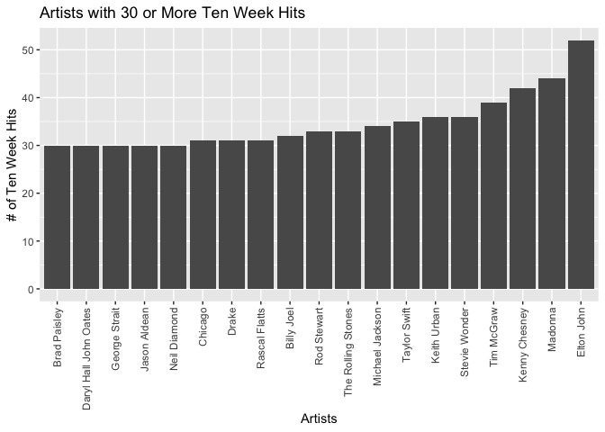
This chart shows all Artists with over 30 Ten Week Hit. As well it shows
that the most Ten Week Hits by any Artist is Elton John. The only
Artists with over 40 Ten Week Hits are Kenny Chesney, Madonna and Elton
John \# 3) Wrangling the Olympics

    olympics_top20 <- read.csv("olympics_top20.csv")

    #Part A of Question 3 Data Mining#
    women_height=olympics_top20%>%
      filter(sex=='F')%>%
      group_by(event)%>%
      select(event, height)%>%
      summarize(women_height_95pct=quantile(height,probs=0.95,na.rm=TRUE))%>%
      arrange(desc(women_height_95pct))

    women_height

    ## # A tibble: 132 × 2
    ##    event                                 women_height_95pct
    ##    <chr>                                              <dbl>
    ##  1 Basketball Women's Basketball                       198.
    ##  2 Volleyball Women's Volleyball                       193 
    ##  3 Athletics Women's Shot Put                          192.
    ##  4 Swimming Women's 200 metres Freestyle               191 
    ##  5 Athletics Women's Heptathlon                        189.
    ##  6 Athletics Women's Discus Throw                      188.
    ##  7 Athletics Women's High Jump                         188 
    ##  8 Rowing Women's Coxed Eights                         188 
    ##  9 Rowing Women's Double Sculls                        188.
    ## 10 Athletics Women's Triple Jump                       187.
    ## # … with 122 more rows

    #Part B of Question 3 Data Mining#
    womens_height_variability=olympics_top20%>%
      filter(sex=='F')%>%
      group_by(event)%>%
      select(event, height)%>%
      summarize(height_variability=sd(height))%>%
      arrange(desc(height_variability))

    View(womens_height_variability)

    #Part C of Question Data Mining#
    swimmers_age=olympics_top20%>%
      filter(sport=='Swimming')%>%
      group_by(year,sex)%>%
      summarize(mean_age=mean(age))

    ## `summarise()` has grouped output by 'year'. You can override using the `.groups` argument.

    View(swimmers_age) 

    #Graph for Part C#
    ggplot(swimmers_age)+
      geom_line(aes(x=year,y=mean_age,color=sex))+
      xlab('Olympic Years')+
      ylab("Average Swimmer's Age")+
      labs(
        title="Average Swimmer's Age at Each Olympics By Sex",
      )

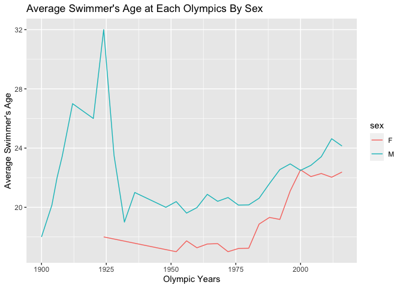
The average age of olypmic swimmers over time has steadily increased
since 1900.The large spike for the age of men in the early 1900’s is
most likely due to World War 1.Women tend to be younger swimmers at the
olympics than men, but both have steadily increased in average age since
1975 onwards. \# 4) K-nearest neighbors

    library(caret)

    ## Loading required package: lattice

    ## 
    ## Attaching package: 'caret'

    ## The following object is masked from 'package:purrr':
    ## 
    ##     lift

    library(rsample)
    library(modelr)
    library(foreach)

    ## Warning: package 'foreach' was built under R version 4.1.2

    ## 
    ## Attaching package: 'foreach'

    ## The following objects are masked from 'package:purrr':
    ## 
    ##     accumulate, when

    library(parallel)
    sclass <- read_csv("sclass.csv")

    ## Rows: 29466 Columns: 17

    ## ── Column specification ────────────────────────────────────────────────────────
    ## Delimiter: ","
    ## chr (11): trim, subTrim, condition, color, displacement, fuel, state, region...
    ## dbl  (5): id, mileage, year, featureCount, price
    ## lgl  (1): isOneOwner

    ## 
    ## ℹ Use `spec()` to retrieve the full column specification for this data.
    ## ℹ Specify the column types or set `show_col_types = FALSE` to quiet this message.

    #Creating Table for Trim Level 350#
    set.seed(9)
    trim350=sclass%>%
      filter(trim==350)%>%
      select(price,mileage)

    View(trim350)

    ggplot(data=trim350)+
      geom_point(mapping=aes(x=mileage,y=price))

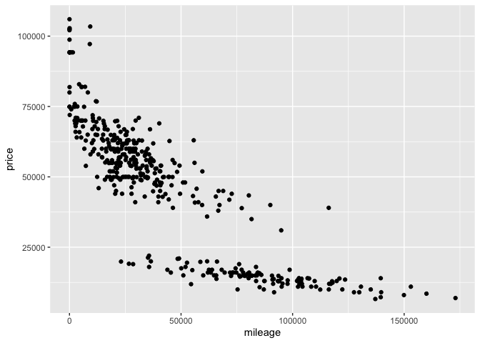

    #Making the split#
    trim350_split= initial_split(trim350, prop=0.8)
    trim350_train= training(trim350_split)
    trim350_test= testing(trim350_split)

    #Models#
    lm1= lm(price~mileage,data=trim350_train)
    lm2=lm(price~poly(mileage,2),data=trim350_train)

    #KNN Regression at K=2#

    trim350_knn2=knnreg(price~mileage,data=trim350_train)
    rmse(trim350_knn2,trim350_test)

    ## [1] 9968.7

    #More KNN tests#
    trim350_knn10=knnreg(price~mileage,data=trim350_train,k=10)
    rmse(trim350_knn10,trim350_test)

    ## [1] 9891.514

    trim350_knn25=knnreg(price~mileage, data=trim350_train,k=25)
    rmse(trim350_knn25,trim350_test)

    ## [1] 9972.233

    #Attach Predictions to the Test Data#
    trim350_test=trim350_test%>%
      mutate(price350_predk2=predict(trim350_knn2,trim350_test))

    #Graph the Predictions for K=2#
    p_test350k2=ggplot(data=trim350_test)+
      geom_point(mapping=aes(x=mileage,y=price),alpha=0.2)
    p_test350k2+geom_line(aes(x=mileage,y=price350_predk2),color='red',size=1.5)+
      xlab('Mileage')+
      ylab('Price')+
      labs(
        title='K Nearest Neighbors Prediction for Price
        Based on Mileage for an S-Class Trim 350, K=2'
      )

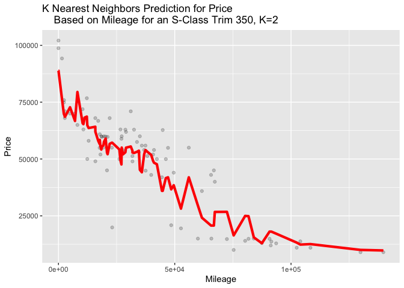

    #Other Graphs for Different K Values#
    trim350_test=trim350_test%>%
      mutate(price350_predk10=predict(trim350_knn10,trim350_test))

    trim350_test=trim350_test%>%
      mutate(price350_predk25=predict(trim350_knn25,trim350_test))

    p_test350k10=ggplot(data=trim350_test)+
      geom_point(mapping=aes(x=mileage,y=price),alpha=0.2)
    p_test350k10+geom_line(aes(x=mileage,y=price350_predk10),color='red',size=1.5)+
      xlab('Mileage')+
      ylab('Price')+
      labs(
        title='K Nearest Neighbors Prediction for Price
        Based on Mileage for an S-Class Trim 350, K=10'
      )

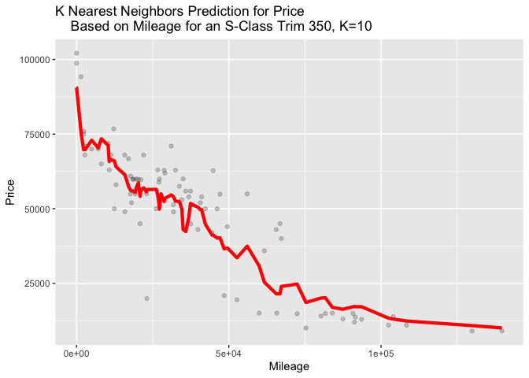

    p_test350k25=ggplot(data=trim350_test)+
      geom_point(mapping=aes(x=mileage,y=price),alpha=0.2)
    p_test350k25+geom_line(aes(x=mileage,y=price350_predk25),color='red',size=1.5)+
      xlab('Mileage')+
      ylab('Price')+
      labs(
        title='K Nearest Neighbors Prediction for Price
        Based on Mileage for an S-Class Trim 350, K=25'
      )

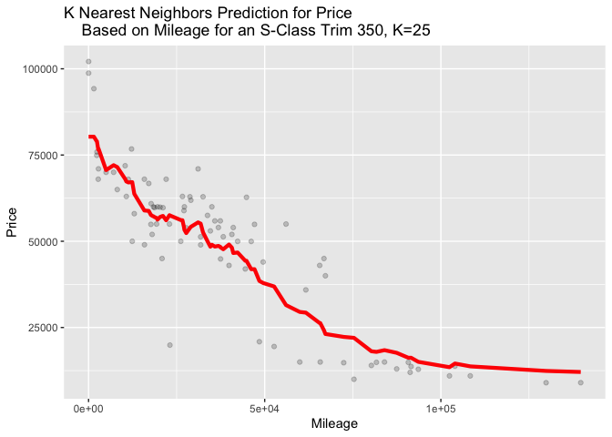

    #Finding the Perfect Value of K for 350 Trim#
    rmse_out350=foreach(i=1:75, .combine='c') %do% {
      knn_model350= knnreg(price~mileage, data=trim350_train, k=i)
      modelr::rmse(knn_model350,trim350_test)
    }
    rmse_out350

    ##  [1] 12883.431 11100.561 10458.050 10353.848  9968.700 10275.429 10087.686
    ##  [8] 10118.309  9937.921  9891.514  9953.730  9882.909  9895.301  9731.420
    ## [15]  9587.941  9688.248  9804.762  9771.538  9749.324  9742.403  9777.293
    ## [22]  9765.844  9819.277  9957.267  9972.233  9923.309  9971.797 10041.561
    ## [29] 10014.958 10048.366 10036.062 10010.992 10014.002  9989.631 10010.620
    ## [36] 10027.958 10053.459 10076.736 10019.220 10002.808  9997.110 10009.315
    ## [43]  9987.982 10024.931 10022.894 10016.535 10034.362 10069.036 10114.166
    ## [50] 10135.967 10164.685 10164.959 10213.917 10208.015 10247.100 10270.271
    ## [57] 10292.384 10261.726 10286.716 10320.042 10344.179 10339.055 10327.634
    ## [64] 10326.856 10341.891 10342.641 10327.814 10337.173 10396.270 10388.381
    ## [71] 10441.928 10495.438 10515.209 10517.427 10545.557

    k=c(1:75)
    bestk_350=data.frame(k,rmse_out350)
    ggplot(bestk_350)+
      geom_line(aes(x=k,y=rmse_out350))+
      geom_vline(xintercept=15, color='red')+
      xlab('# of K Nearest Neighbors')+
      ylab('Root Mean Square Deviation')+
      labs(
        title="Root Mean Square Deviation for Each #K Nearest Neighbor:
                                              Trim 350"
      )

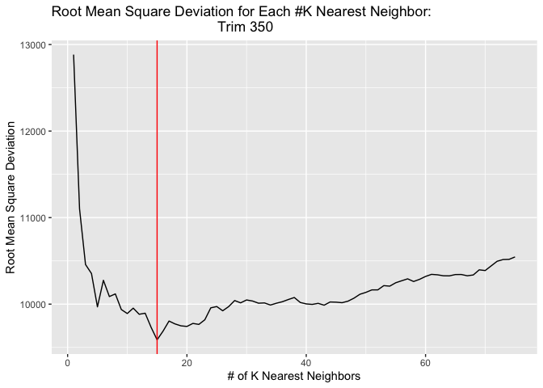

    trim350_knn15=knnreg(price~mileage,data=trim350_train,k=15)
    rmse(trim350_knn15,trim350_test)

    ## [1] 9587.941

    trim350_test=trim350_test%>%
      mutate(price350_predk15=predict(trim350_knn15,trim350_test))

    p_test350k15=ggplot(data=trim350_test)+
      geom_point(mapping=aes(x=mileage,y=price),alpha=0.2)
    p_test350k15+geom_line(aes(x=mileage,y=price350_predk15),color='red',size=1.5)+
      xlab('Mileage')+
      ylab('Price')+
      labs(
        title='K Nearest Neighbors Prediction for Price
        Based on Mileage for an S-Class Trim 350, K=15'
      )

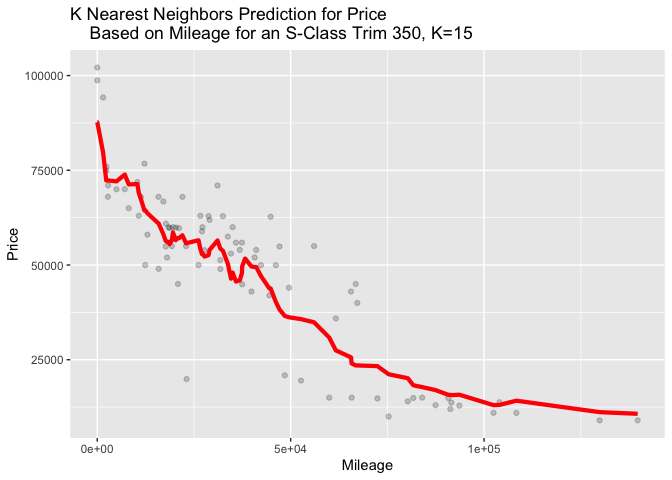

    #Creating Table for Trim Level 6 AMG#
    trim65AMG=sclass%>%
      filter(trim=='65 AMG')%>%
      select(price,mileage)

    View(trim65AMG)

    #Making the split#
    trim65AMG_split= initial_split(trim65AMG, prop=0.8)
    trim65AMG_train= training(trim65AMG_split)
    trim65AMG_test= testing(trim65AMG_split)

    #Models#
    lm1= lm(price~mileage,data=trim65AMG_train)
    lm2=lm(price~poly(mileage,2),data=trim65AMG_train)

    #KNN Regression at K=2#

    trim65AMG_knn2=knnreg(price~mileage,data=trim65AMG_train)
    rmse(trim65AMG_knn2,trim65AMG_test)

    ## [1] 18566.02

    #More KNN tests#
    trim65AMG_knn10=knnreg(price~mileage,data=trim65AMG_train,k=10)
    rmse(trim65AMG_knn10,trim65AMG_test)

    ## [1] 18848.2

    trim65AMG_knn25=knnreg(price~mileage, data=trim65AMG_train,k=25)
    rmse(trim65AMG_knn25,trim65AMG_test)

    ## [1] 18424.15

    #Attach Predictions to the Test Data#
    trim65AMG_test=trim65AMG_test%>%
      mutate(price65AMG_predk2=predict(trim65AMG_knn2,trim65AMG_test))

    #Graph the Predictions for K=2#
    p_test65AMGk2=ggplot(data=trim65AMG_test)+
      geom_point(mapping=aes(x=mileage,y=price),alpha=0.2)
    p_test65AMGk2+geom_line(aes(x=mileage,y=price65AMG_predk2),color='red',size=1.5)+
      xlab('Mileage')+
      ylab('Price')+
      labs(
        title='K Nearest Neighbors Prediction for Price
        Based on Mileage for an S-Class Trim 65AMG, K=2'
      )

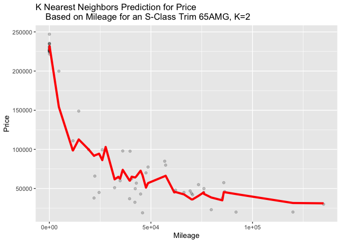

    #Other Graphs for Different K Values to See Differences#
    trim65AMG_test=trim65AMG_test%>%
      mutate(price65AMG_predk10=predict(trim65AMG_knn10,trim65AMG_test))

    trim65AMG_test=trim65AMG_test%>%
      mutate(price65AMG_predk25=predict(trim65AMG_knn25,trim65AMG_test))

    p_test65AMGk10=ggplot(data=trim65AMG_test)+
      geom_point(mapping=aes(x=mileage,y=price),alpha=0.2)
    p_test65AMGk10+geom_line(aes(x=mileage,y=price65AMG_predk10),color='red',size=1.5)+
      xlab('Mileage')+
      ylab('Price')+
      labs(
        title='K Nearest Neighbors Prediction for Price
        Based on Mileage for an S-Class Trim 65AMG, K=10'
      )

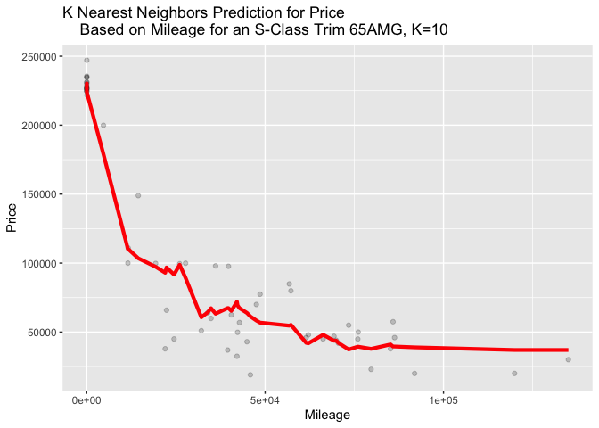

    p_test65AMGk25=ggplot(data=trim65AMG_test)+
      geom_point(mapping=aes(x=mileage,y=price),alpha=0.2)
    p_test65AMGk25+geom_line(aes(x=mileage,y=price65AMG_predk25),color='red',size=1.5)+
      xlab('Mileage')+
      ylab('Price')+
      labs(
        title='K Nearest Neighbors Prediction for Price
        Based on Mileage for an S-Class Trim 65AMG, K=25'
      )

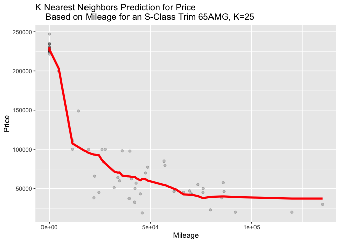

    #Finding the Perfect Value for K for Trim 65AMG#
    rmse_out65AMG=foreach(i=1:75, .combine='c') %do% {
      knn_model65AMG= knnreg(price~mileage, data=trim65AMG_train, k=i)
      modelr::rmse(knn_model65AMG,trim65AMG_test)
    }
    rmse_out65AMG

    ##  [1] 30463.50 22720.01 20695.91 18922.73 18566.02 17821.76 18778.39 19125.88
    ##  [9] 19004.10 18848.20 18689.25 19450.37 19354.19 19033.20 19280.25 19378.76
    ## [17] 19410.95 19066.91 18914.31 18466.57 18399.33 18323.39 18461.43 18455.60
    ## [25] 18424.15 18338.66 18448.10 18532.62 18559.76 18668.40 18449.08 18200.35
    ## [33] 18076.95 18048.02 17953.81 18050.69 18083.70 18234.81 18227.63 18439.20
    ## [41] 18551.05 18786.76 18755.42 18657.76 18703.44 18821.81 18974.98 19054.48
    ## [49] 19095.35 19103.61 19130.40 19293.26 19317.33 19698.72 20022.55 19980.99
    ## [57] 20007.98 20101.07 20055.77 20023.19 20092.18 20311.49 20477.36 20569.65
    ## [65] 20904.75 21133.38 21223.97 21342.06 21325.07 21747.90 22093.28 22269.21
    ## [73] 22266.09 22376.73 22700.49

    k=c(1:75)
    bestk_65AMG=data.frame(k,rmse_out65AMG)
    ggplot(bestk_65AMG)+
      geom_line(aes(x=k,y=rmse_out65AMG))+
      geom_vline(xintercept=6, color='red')+
      xlab('# of K Nearest Neighbors')+
      ylab('Root Mean Square Deviation')+
      labs(
        title="Root Mean Square Deviation for Each #K Nearest Neighbor:
                                              Trim 65AMG"
      )

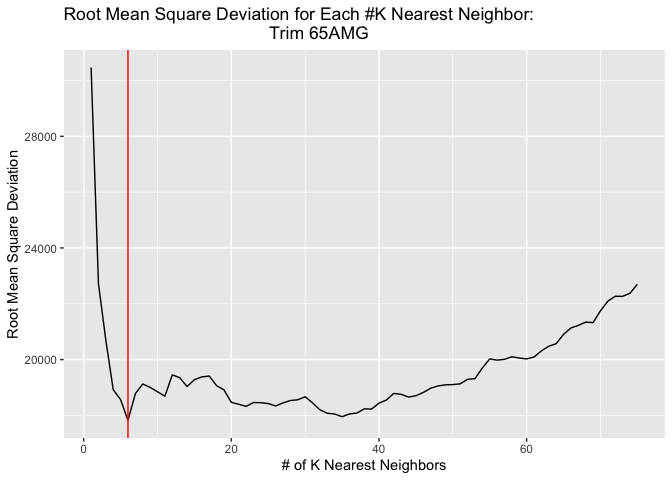

    #Fitting Predictions to Real Data for BEst Value of K Trim 65AMG
    trim65AMG_knn6=knnreg(price~mileage,data=trim65AMG_train,k=6)
    rmse(trim65AMG_knn6,trim65AMG_test)

    ## [1] 17821.76

    trim65AMG_test=trim65AMG_test%>%
      mutate(price65AMG_predk6=predict(trim65AMG_knn6,trim65AMG_test))

    p_test65AMGk6=ggplot(data=trim65AMG_test)+
      geom_point(mapping=aes(x=mileage,y=price),alpha=0.2)
    p_test65AMGk6+geom_line(aes(x=mileage,y=price65AMG_predk6),color='red',size=1.5)+
      xlab('Mileage')+
      ylab('Price')+
      labs(
        title='K Nearest Neighbors Prediction for Price
        Based on Mileage for an S-Class Trim 65AMG, K=6'
      )

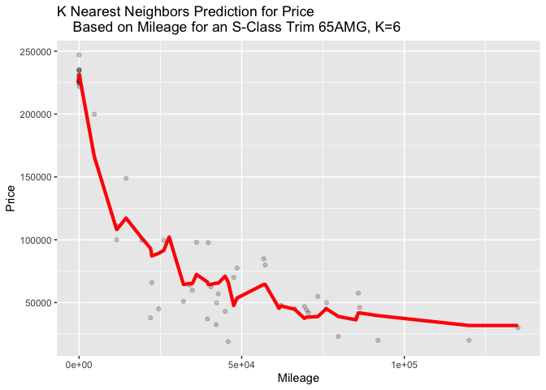
The trim level 350 has a larger value for K Nearest Neighbors compared
to 65AMG. I believe this is because the trim level 350 has about 100
more observations than 65AMG. This means that the 350 trim is more
likely to have more variance. To compensate for the problem of variance
using a larger K allows for it to compare across larger spreads of data.
